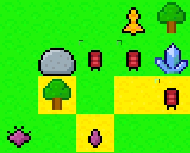

# Why Crystals ?

*Why Crystals* is an indie grid-based turn-based strategy tower defence game, currently in very early development.

Here is what it looks like for now:



It is not fun yet, come back later!

## Dependencies

- [SDL 2.0](https://wiki.libsdl.org/) (`libsdl2-dev`)
- [SDL_image 2.0](https://github.com/libsdl-org/SDL_image) (`libsdl2-image-dev`)
- [SDL_ttf 2.0](https://github.com/libsdl-org/SDL_ttf) (`libsdl2-ttf-dev`)

## Building

```sh
# Build
python3 bs.py -d
# Build and run (args after the `-l` are forwarded to the binary)
python3 bs.py -d -l
```

The `-d` here is for debug and it will cause the compiler to be given the argument `-fsanitize=undefined`. It enables detection of undefined behavior, which is pretty cool, but it may make the executable depend on a shared library that may not be installed by default, in which case either install it or remove the `-d`.

## Explainations

The development is so early this is still pretty much a (bad) prototype, gameplay elements are changing all the time, and I don't want to rewrite the explainations every time. Come back later.

If you really want to try it, here is a probably not up-to-date guide: The goal is to protect the crystal from the enemies. The player controls 3 units that can move and place towers, and the towers will shoot at the enemies. Each unit gets to act once per turn, either by moving on a nearby tile (left-click) or by placing a tower (right-click) (one tower per turn). The middle mouse button or the space key signals will end the player phase, then the enemies play, then the towers shoot, then back to the player. Hold left-control to display all the controls. A newly placed tower has 4 ammo, consumes one ammo per shot, eventually running out and shutting down. A tower shoots at most once per turn on the nearest visible enemy in a straight line, but not on an adjacent tile. One can figure out the enemies' abilities and behavior by playing a few games (this is part of the fun too).

Some tips: This is not a classic tower defence, this is a grid-based turn-based strategy game where the precise position of objects on the map can be very important. Units travel slowly, becareful not to let a critical area unatended. If a tower is placed too close to an enemy, the enemy may get to an adjacent tile on which the tower cannot shoot (as towers shoot after the enemies move). Sometimes an unlucky egg blocks some enemies, but a tower is in position to shoot it; so keep in mind that placing a unit between the tower and the egg will block the shot. The same trick of blocking the view of a tower to a close enemy can be applied to make a far enemy the only visible target, that can be useful is some specific cases. Placing too much towers will make it harder for the units to move, so placing towers for the sake of it is generally a bad idea.

## Known problem

The map may be somewhat infinte but for now the parts that get generated when one takes the camera on a long trip will stay loaded and may slow down the game considerably (optimizations will come later, now is the time of prototyping and bad code). The only current workaround for that problem is to stay focused on the area around the crystal.

## Suggestions and bug/problem reports

Don't hesitate!

## Contributions

- Don't hesitate to pull-request bug fixes and small improvements.
- Bigger scale contributions to the code can be talked about.
- If you are an artist able to produce cool sprites, sounds, music, fonts, and other cool assets, and if you are intrested in contributing (for free, this is only a passion project), then please get in touch!
